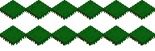

# Modding API

## API by example

### Defining your mod

---

An instance of the `Mod` class called `mod` must be accessible in `__init__.py`.

You can do this either by defining it there:

```python
# __init__.py
from api import Mod
mod = Mod("mymod", "My super cool Mod")
```

or by importing it:

```python
# mymoddefinition.py
from api import Mod
mod = Mod("mymod", "My super cool Mod")
```

```python
# __init__.py
from mymoddefinition import mod
```

### Adding registry values

---

Total Domination uses a lookup system that translates ids to paths to either json or texture files.

You can add values to it by using `Mod.add_registry()` for single values and `Mod.add_registry_file()` for loading entire json files.

Here we define everything we need for a unicorn with the id `mymod:unicorn` (Similar to Minecraft, for instance, TD uses a `mod_id:thing_id` syntax for ids):

```python
# somewere that has access to `mod` and runs when __init__.py is called
from pathlib import Path
mod.add_registry("textures", "mymod:unicorn", Path(f"{mod.dir}/textures/unicorn.jsonc")) # A static texture would end in `.png` but we want some _animations_, so we will use a sprite sheet.
mod.add_registry("textures", "mymod:lolipop_forest", Path(f"{mod.dir}/textures/lolipop_forest.png"))
mod.add_registry("actors", "mymod:unicorn", Path(f"{mod.dir}/actors/unicorn.jsonc"))
```

In case you have to add a **lot** of registry values (like the base game), you can but them in a json file and load them like so:

(Taken from the vanilla game "mod")

```python
# __init__.py
from api import Mod

mod = Mod("td", "Total Domination")

mod.add_registry_file("textures", Path("$resource_dir$/registry/textures.jsonc"))
mod.add_registry_file("actors", Path("$resource_dir$/registry/actors.jsonc"))
```

`textures.jsonc`:

```json
{
    "name":         "Default",
    "description":  "The default TD textures",
    "data": {
        // INTERNAL //
        "td:selected_tile_top": "$texture_dir$/ui/selected_tile/top.png",
        "td:selected_tile_left": "$texture_dir$/ui/selected_tile/left.png",
        "td:selected_tile_right": "$texture_dir$/ui/selected_tile/right.png",
        "td:test": "$texture_dir$/test.png",
        // Tiles //
        "td:tile_missing": "$texture_dir$/tiles/missing.png",
        "td:dirt": "$texture_dir$/tiles/dirt.png",
        "td:dry_dirt": "$texture_dir$/tiles/dry_dirt.png",
        "td:stone": "$texture_dir$/tiles/stone.png",
        // Tops //
        "td:top_missing": "$texture_dir$/tiles/tops/missing.png",
        "td:top_grass": "$texture_dir$/tiles/tops/grass.jsonc",
        "td:top_grass_plane": "$texture_dir$/tiles/tops/grass_plane.png",
        "td:top_forest": "$texture_dir$/tiles/tops/forest.png",
        "td:top_dry_grass": "$texture_dir$/tiles/tops/dry_grass.png",
        "td:top_scorched_earth": "$texture_dir$/tiles/tops/scorched_earth.png",
        "td:top_snow": "$texture_dir$/tiles/tops/snow.png",
        // Card Parts //
        "td:card_parts:background_front": "$texture_dir$/cards/background_front.png", // You can use a sub-id-syntax like: `mod_id:sub_id:thing_id` for basically how long you want: `mod_id:sub_id_1:<...>:sub_id_n:thing_id`
        "td:card_parts:background_back": "$texture_dir$/cards/background_back.png",
        "td:card_parts:shine": "$texture_dir$/cards/shine.png",
        "td:card_parts:seal_neutral": "$texture_dir$/cards/seal/neutral.png",
        "td:card_parts:seal_unit": "$texture_dir$/cards/seal/unit.png",
        "td:card_parts:seal_military_building": "$texture_dir$/cards/seal/military_building.png",
        "td:card_parts:seal_economy_building": "$texture_dir$/cards/seal/economy_building.png",
        // Actors //
        "td:industrial_lumberjack": "$texture_dir$/actors/buildings/industrial_lumberjack.jsonc",
        "td:human_palace": "$texture_dir$/actors/buildings/human_palace.png",
        // Resources //
        "td:wood": "$texture_dir$/ui/resources/wood.png"
    }
}
```

And `actors.jsonc` is similar:

```json
{
    "name":        "Default",
    "description": "The default TD units & buildings",
    // Note: there is no actual diffrence between buildings and units, buildings just have a movement speed of 0
    "data": {
        "td:industrial_lumberjack": "$actor_dir$/buildings/industrial_lumberjack.jsonc",
        "td:human_palace": "$actor_dir$/buildings/human_palace.jsonc"
    }
}
```

### Defining actors

Actors in TD describe a players units and buildings, as they are what **acts** in-game.

So let's define out unicorn:

```json
// {mod.dir}/textures/unicorn.jsonc
{
    "name": "Unicorn",
    "type": "td:unit", // Type is for grouping and card that affect diffrent types. The actual diffrence between an unit and a building is the movement speed.
    "hp": 999999,
    "movement_speed": 10, // Every tile has a base cost * multiplier that is needed to cross it. Let's make out unicorn super fast.
    "attack_value": 100000, // It should also be insanely strong
    "defence_value": 999999, // And basically unkillable
    "code": {
        "round": [ // Every round our unicorn should produce 1 Mana and 1 Gold
            {
                "function": "td:produce_item",
                "arguments": ["td:mana"]
            },
            {
                "function": "td:produce_item",
                "arguments": ["td:gold"]
            }
        ],
        "spawn": [{ // When spawning, the unicorn should place a `mymod:lolipop_forest` tile under itself. We will make our own function for this.
            "function": "mymod:replace_tile",
            "arguments": ["mymod:lolipop_forest"]
        }],
        "death": [{ // It seems this unicorn has absorbed some abilitys of the phoenix and is thus able to revive itself upon death.
            "function": "td:spawn_actor",
            "arguments": ["mymod:unicorn", "$x$", "$y$"]
        }]
    }
}
```

### Textures

TD can load two types of textures for our actor: a simple, static texture in a png file or a spritesheet.

The simple PNG is self-explanatory, it just loads the file's contents and displays them.


Spritesheets are a lot more interesting.

While many games use spritesheets the exact implementation varies, so I will focus on TD's implementation.

In TD, all frames of an animation are stored in a row; each row is it's own animation (death animation, attack animation, idle animation, etc).

In the case of tiles, an animation is picked at random when they are loaded, allowing for variations in the tiles and making it less repedetive:



(You might have to zoom in, as the texture is quite small)

A json file tells the computer were one frame starts and ends:

```json
{
    "frames": {
        "alt1": [
            { "x": 0, "y": 0, "w": 32, "h": 32 },
            { "x": 0, "y": 0, "w": 32, "h": 32 },
            { "x": 32, "y": 0, "w": 32, "h": 32 },
            { "x": 32, "y": 0, "w": 32, "h": 32 },
            { "x": 64, "y": 0, "w": 32, "h": 32 },
            { "x": 64, "y": 0, "w": 32, "h": 32 },
            { "x": 96, "y": 0, "w": 32, "h": 32 },
            { "x": 96, "y": 0, "w": 32, "h": 32 },
            { "x": 128, "y": 0, "w": 32, "h": 32 },
            { "x": 128, "y": 0, "w": 32, "h": 32 },
            { "x": 160, "y": 0, "w": 32, "h": 32 },
            { "x": 160, "y": 0, "w": 32, "h": 32 }
        ],
        "alt2": [
            { "x": 0, "y": 32, "w": 32, "h": 32 },
            { "x": 0, "y": 32, "w": 32, "h": 32 },
            { "x": 32, "y": 32, "w": 32, "h": 32 },
            { "x": 32, "y": 32, "w": 32, "h": 32 },
            { "x": 64, "y": 32, "w": 32, "h": 32 },
            { "x": 64, "y": 32, "w": 32, "h": 32 },
            { "x": 96, "y": 32, "w": 32, "h": 32 },
            { "x": 96, "y": 32, "w": 32, "h": 32 },
            { "x": 128, "y": 32, "w": 32, "h": 32 },
            { "x": 128, "y": 32, "w": 32, "h": 32 },
            { "x": 160, "y": 32, "w": 32, "h": 32 },
            { "x": 160, "y": 32, "w": 32, "h": 32 }
        ]
    },
    "texture": "$texture_dir$/tiles/tops/grass.png",
    "meta": {
        "app": "http://www.aseprite.org/",
        "version": "0.1-dev"
    }
}
```


## Exitcodes

### ModServer responses

| Code | Sender      | Description
|:----:|:------------|:--------------
| `-1` | `ModServer` | Requesting function
| `0`  | `ModServer` | OK
| `1`  | `ModServer` | Misc error
| `2`  | `ModServer` | Unknown request type
| `3`  | `ModServer` | ill formed request
| `4`  | `ModServer` | invalid mod source code

### Function request responses

| Code | Sender               | Description
|:----:|:---------------------|:--------------
| `0`  | `ModServerConnector` | OK
| `1`  | `ModServerConnector` | Misc error
| `2`  | `ModServerConnector` | Unknown function
